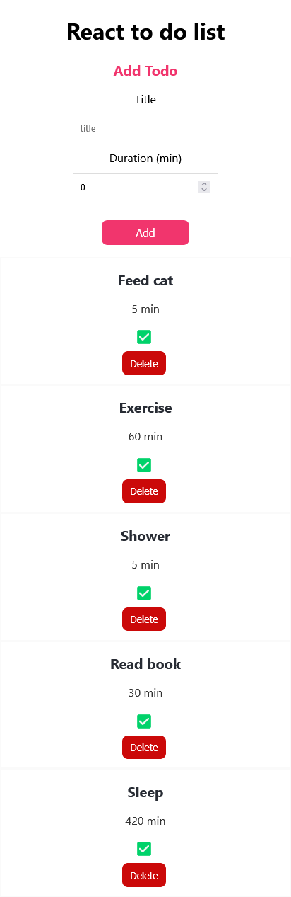

## Table of contents

- [Overview](#overview)
  - [React-to-do](#react-to-do)
  - [Project setup](#project-setup)
  - [Built with](#built-with)
  - [Screenshot](#screenshot)
  - [Author](#author)

## Overview

### React-to-do

Welcome to "React-to-do" list, this is my first React project.
This was created so I could learn about React and how to use it.

You can Add, Remove, and press done for the Todos.
This is a basic Todo, to work with arrays and components.

## Project setup

```
npm install
```

### Compiles and hot-reloads for development

```
npm start
```

Runs the app in the development mode.\
Open [http://localhost:3000](http://localhost:3000) to view it in the browser.

### Compiles and minifies for production

```
npm run build
```

Builds the app for production to the `build` folder.\
It correctly bundles React in production mode and optimizes the build for the best performance.
The build is minified and the filenames include the hashes.\

### Built with

- React
- React components
- JavaScript
- TypeScript
- Css
- Sass/scss

### Screenshot



### Author

[Github](https://github.com/Rasweb)

[Website](https://rasweb.one/)
